# Outdoor Navigational Watch

The project aims at building a watch designed to offer real-time information about the current UTC time, geographical position, and directional orientation, as well as environmental data including atmospheric pressure, calculated altitude, ambient temperature, ambient humidity.

<p align="center">
  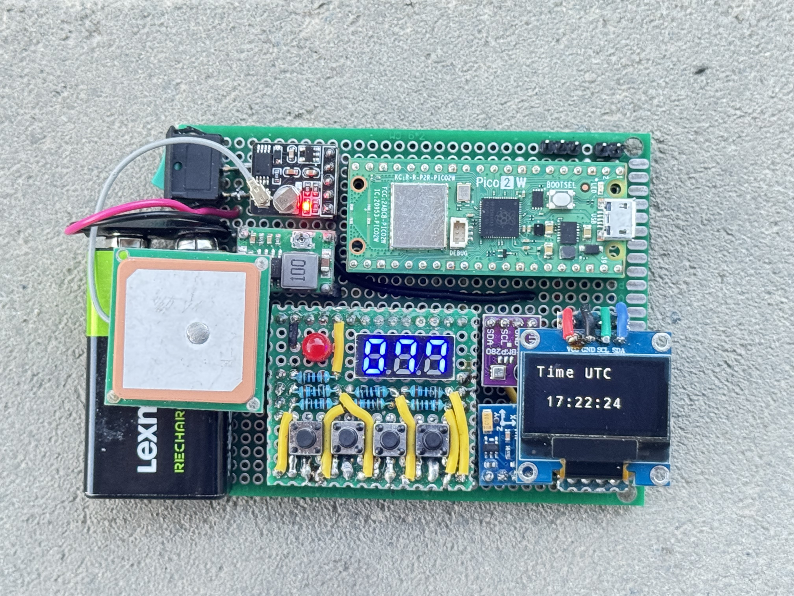
</p>

## Hardware

### Processing Unit
* **Microcontroller:** Raspberry Pi Pico 2W (RP2350A, Cortex-M33)

### Sensors
* **GNSS Module:** ATGM336H-5N (Geographical Position & UTC Time)
* **Magnetometer:** QMC5883L (Directional Compass)
* **Atmospheric Sensor:** BME280 (Atmospheric Pressure, Ambient Temperature, Ambient Humidity)

### Display
* **Main Screen:** SSD1306 (128x64 Monochrome OLED)
* **Compass & Battery:** 7-Segment Display
* **Status Indicator:** Coloured LED

### User Input
**4 buttons** (left to right)

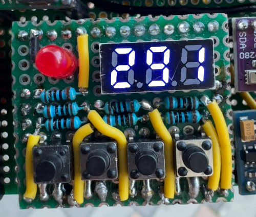

* **Power button**
    * **Press:** Toggle the display on and off
    * **Hold:** Show battery voltage
* **Navigation left**
    * **Press:** Previous display page
    * **Hold:** Start / Cancel compass calibration
* **Navigation right**
    * **Press:** Next display page
    * **Hold for 5 seconds:** Reset compass calibration
* **Action button**
    * **Press:** Change displayed unit
    * **Hold:** Toggle compass reading

### Connections

The pico 2 board is powered using 5V (external source, USB or a 9V battery connected to the voltage step-down).  
The sensors and displays are powered from the Pico 3V3 rail.  
Power requirement: **~0.5W**

* **GPIO:**
    * 4 buttons for the keypad (10 μF capacitor, internal pull up, active low)
    * 6 pins for 7-segment display (100 Ω resistor, active high)
    * 1 interrupt pin for qmc5883l (active high)
    * 1 LED pin (100 Ω resistor, active high)

* **I<sup>2</sup>C0:** (100 kHz)
    * QMC5883L
    * SSD1306

* **I<sup>2</sup>C1:** (100 kHz)
    * BME280

* **UART0:** (9600 bps)
    * ATGM336H-5N

* **UART1:** (115200 bps)
    * Zephyr console / shell

* **ADC2:**
    * Battery

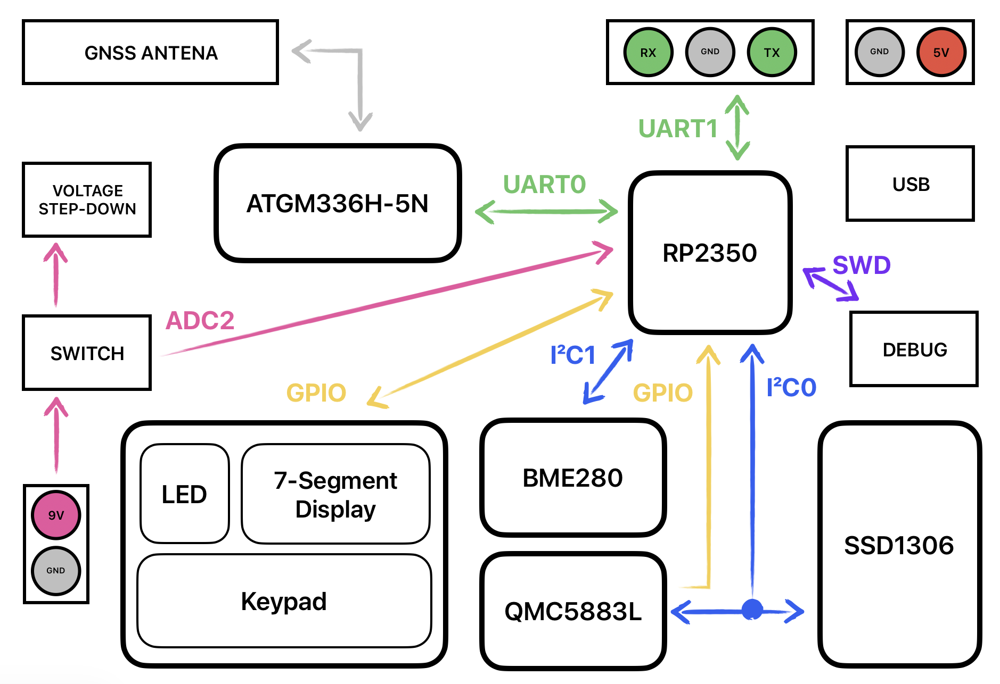


## Software

### Firmware
* **Operating System:** Zephyr RTOS
* **Graphics Library:** Zephyr character framebuffer
* **Language:** C

### Input
* **GNSS Module:** Reading data over UART
* **User Input:** GPIO interrupts from the buttons
* **Magnetometer:** Hardware interrupt when new data is available
* **Atmospheric Sensor:** Sending read commands to the sensor over I<sup>2</sup>C
* **Battery Level:** Analog-to-Digital Converter monitoring:
    * **On-Demand:** Hardware interrupt triggered by the battery status button
    * **Scheduled:** Periodic polling to monitor voltage for low-battery warning

### Output
* **Main Screen:** Managed via Zephyr display libraries
* **Compass & Battery:** Driven via GPIO for the 7-segment display
* **Status Indicator:** Driven via GPIO for LED control

### Threads
* **QMC5883L:** (priority **7**, period **100ms** / **10Hz**, **hardware interrupt**)
    * Implements the logic required to configure and read data from the *magnetometer*
    * Calculates heading based on read values
    * Calculates and sets calibration values

* **Altimeter:** (priority **7**, period **200ms** / **5Hz**)
    * Reads the data from the *atmospheric sensor* and calculates the required values: altitude, adjusted altitude and absolute humidity

* **Compass:** (priority **7**, period **250ms** / **4Hz** or **on key event**)
    * Processes the user inputs for the different compass actions:
        * Read and display heading on 7-segment display
        * Send commands to sensor thread for calibration

* **GNSS:** (priority **7**, **UART interrupt**)
    * Receives and processes the GNSS data

* **Keypad:** (priority **3**, period **10ms** / **10Hz** or **on hardware interrupt**)
    * Implement the state machine for each user input key
    * Send event for the different key states:
        * Key press for less then *500ms*
        * Key held for more than *500ms*
        * key released after more than *500ms*

* **Battery:** (priority **10**, period **1s** / **1Hz** or **on key event**)
    * Reads battery voltage and displays it on the 7-segment display when holding the key
    * Measures the battery voltage every second
    * Turns on the status LED when voltage drops below *8V*

* **Segment Display:** (priority **1**, period **500μs** / **2kHz**)
    * Displays a number on the 7-segment display based on the provided format

* **Display:** (priority **5**, period **100ms** / **10Hz** or **on key event**)
    * Processes the user input for the different display actions:
        * Toggle display on or off
        * Change displayed page
        * Change page format
    * Reads the data from the different sensors
    * Converts the values into the appropriate units based on the selected format

### Events

Generated by the *keypad* thread:

* **Battery key events** read by *battery* thread:
    * **Battery on:** power key held → turn on 7-segment display
    * **Battery off:** power key released → turn off 7-segment display

* **Navigation events** read by *display* thread:
    * **Navigation power:** power key press → toggle display on / off
    * **Navigation left:** left key press → update displayed page
    * **Navigation right:** right key press → update displayed page
    * **Navigation select:** action key press → change page state

* **Compass events** read by *compass* thread:
    * **Compass toggle:** action key held → toggle compass reading on / off on 7-segment display
    * **Compass calibrate:** left key held → start / cancel compass calibration
    * **Compass reset start:** right key held → start calibration reset timer
    * **Compass reset stop:** right key released → cancel calibration

### Synchronization
* **Key input:**
    * The state of the hardware key (*pressed* or *released*) is set using *atomic variables* in the interrupt routine on the rising and falling edge
    * Thread is woken up using a *semaphore* set in the interrupt routine

* **Compass reading:**
    * Reads the heading value from a *atomic variable* data when the *qmc5883l* thread sets a *semaphore*
    * Initialises calibration or reset calibration values by setting different *semaphores* that are read by *qmc5883l* thread

* **7-segment display:**
    * Display status, value and format is set by other threads using *shared memory*, synchronized using a *mutex*
    * Thread is woken up by reading a *semaphore* set when turning the display on
    * Before displaying data, the other threads check if the display is off

* **GNSS data:**
    * GNSS data is copied from the callback function to the global memory using a *mutex* for synchronization
    * A *semaphore* is used to signal to the *GNSS* thread that new data has been received and can be processed

* **Display data:**
    * The display thread reads the data from the *altimeter* and *GNSS* thread's shared memory using *mutexes* for synchronization

### System monitoring

Send data periodically over the UART console. Configured using macros in the *SystemStats.h* file.

* **PRINT_STATS:** enable / disable system monitoring
    * **LOG_HEAP:** print system heap usage
    * **LOG_MEMORY:** stack and CPU usage for each thread
    * For *altimeter* and *segment display* threads these values are calculated when system monitoring is enabled and printed based on the following macros are set:
        * **LOG_DEADLINE:** deadline misses in the last *10 seconds*
        * **LOG_LATENCY:** maximum latency in the last *10 seconds*
        * **LOG_JITTER:** jitter during the entire runtime

System monitoring output:
```
Heap: 1028/4096 bytes used (Max: 1028)

Thread analyze:
 segmentDisplay      : STACK: unused 792 usage 232 / 1024 (22 %); CPU: 3 %
                     : Total CPU cycles used: 314177009
 qmc5883l            : STACK: unused 696 usage 328 / 1024 (32 %); CPU: 0 %
                     : Total CPU cycles used: 8753451
 keypad              : STACK: unused 800 usage 224 / 1024 (21 %); CPU: 0 %
                     : Total CPU cycles used: 364788
 gnss                : STACK: unused 712 usage 312 / 1024 (30 %); CPU: 0 %
                     : Total CPU cycles used: 2809
 display             : STACK: unused 408 usage 616 / 1024 (60 %); CPU: 1 %
                     : Total CPU cycles used: 98032464
 compass             : STACK: unused 752 usage 272 / 1024 (26 %); CPU: 0 %
                     : Total CPU cycles used: 957527
 battery             : STACK: unused 728 usage 296 / 1024 (28 %); CPU: 0 %
                     : Total CPU cycles used: 1639368
 altimeter           : STACK: unused 544 usage 480 / 1024 (46 %); CPU: 0 %
                     : Total CPU cycles used: 22958862
 sysworkq            : STACK: unused 536 usage 488 / 1024 (47 %); CPU: 0 %
                     : Total CPU cycles used: 15563534
 logging             : STACK: unused 248 usage 520 / 768 (67 %); CPU: 0 %
                     : Total CPU cycles used: 7729337
 idle                : STACK: unused 256 usage 64 / 320 (20 %); CPU: 94 %
                     : Total CPU cycles used: 8484858924
 ISR0                : STACK: unused 1752 usage 296 / 2048 (14 %); CPU: 0 %
                     : Total CPU cycles used: 0

Jitter: 
 segment display: 300 us
 altimeter: 1800 us

Deadline misses in last 10 seconds: 
 segment display: 11
 altimeter: 1

Max latency in last 10 seconds: 
 segment display: 300 us
 altimeter: 1700 us
```

## User Interface

### Time, Date and Status pages

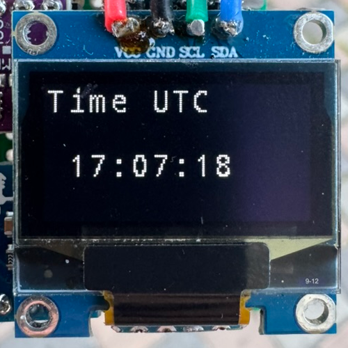
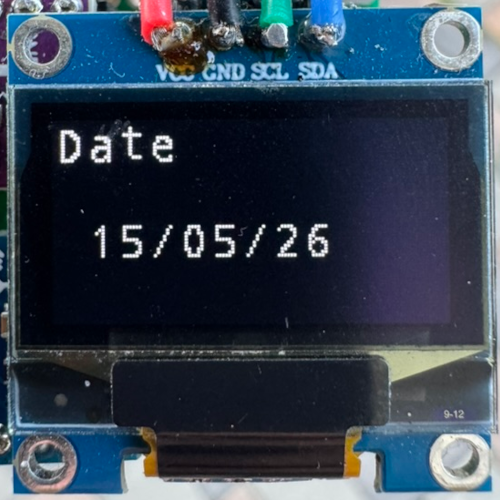
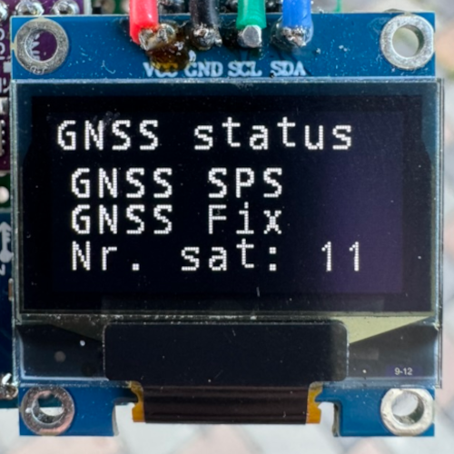

### Position page

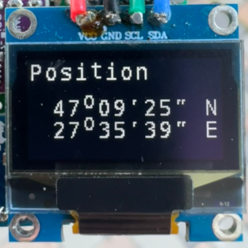
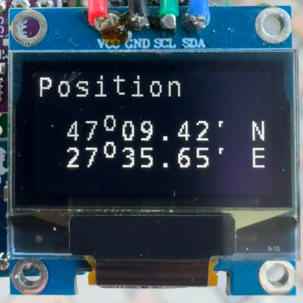
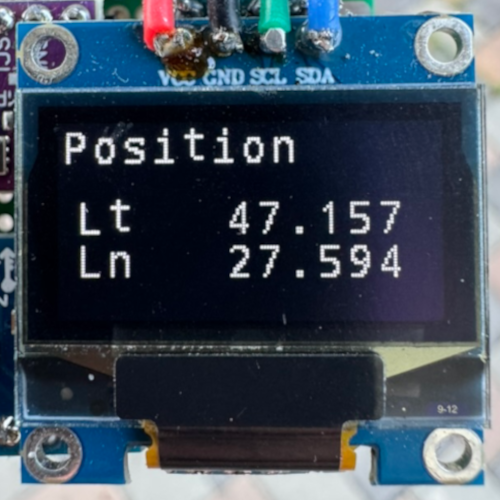

### Altitude page

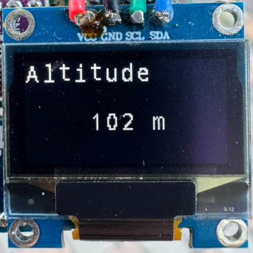
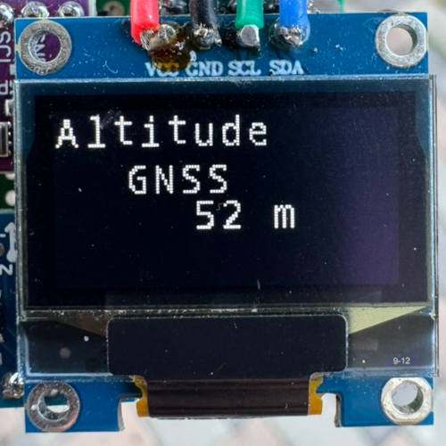
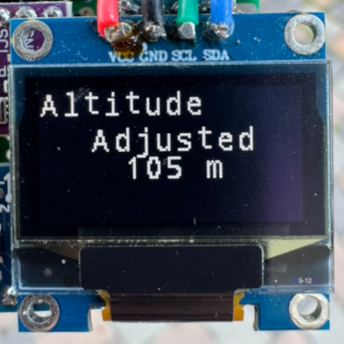

### Environment and Direction

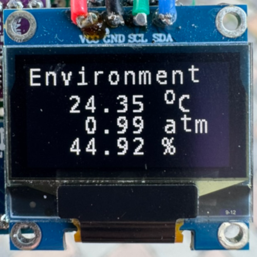
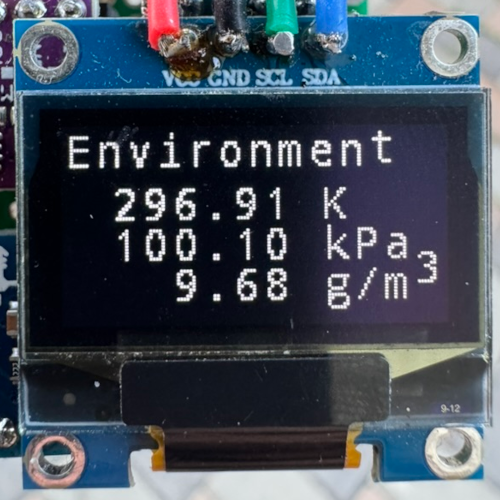
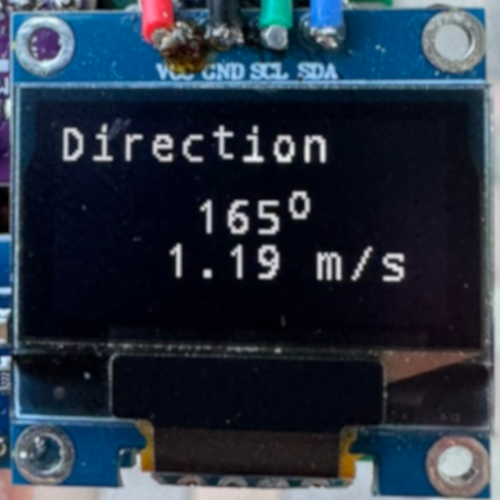
